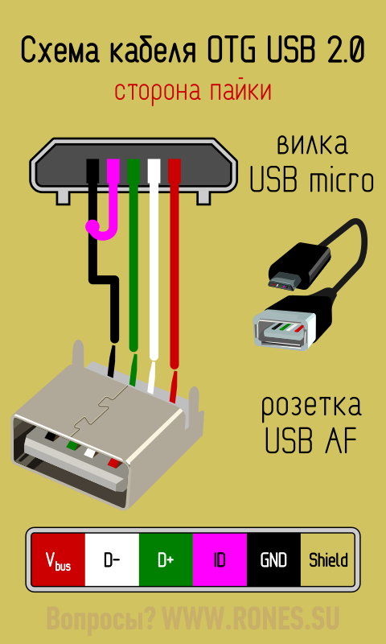

# Доступ к внешним устройствам в ОС Android через USB CDC

Задача: подключить USB-устройство к Android-телефону по OTG. Для исследования был выбран микроконтроллер Raspberry Pi Pico.

Обязательным условием решения задачи является поддержка телефоном OTG. Проверить поддержку можно используя утилиту "OTG Checker" от FaitAuJapon.com, которую можно загрузить с Google Play. На тестовом телефоне - Redmi 5A поддержка OTG присутствует. Альтернативная проверка - использование OTG-кабеля для подключения flash-диска.

Для работы с внешним устройством рекомендуется использовать Java-библиотеку от [mik3y](https://github.com/mik3y/usb-serial-for-android). На эту библиотеку ссылается sandworm в статье [Работа с устройствами USB в Android](https://habr.com/ru/articles/277093/) на Habr.com.

Для исследования взаимодействия с USB-приборами с Android, в статье [How to communicate with Android through USB interface on nRF52820 / nRF52833 / nRF52840](https://jimmywongiot.com/2020/04/21/how-to-communicate-with-android-through-usb-interface-on-nrf52820-nrf52833-nrf52840/) рекомендуется использовать утилиту SimpleUsbTerminal от Kai Morich.

На сайте [USB Serial for Android](https://github.com/mik3y/usb-serial-for-android/tree/master/usbSerialExamples/src/main/java/com/hoho/android/usbserial) есть пример кода на Java, который демонстрирует использование библиотеки mik3y.

Следует заменить, что в примере приложения sbSerialExamples есть файл `\usbSerialExamples\src\main\res\xml\device_filter.xml`, в котором содержится список поддерживаемых USB-мостов:

``` xml
<?xml version="1.0" encoding="utf-8"?>
<resources>
    <!-- 0x0403 / 0x60??: FTDI -->
    <usb-device vendor-id="1027" product-id="24577" /> <!-- 0x6001: FT232R -->
    <usb-device vendor-id="1027" product-id="24592" /> <!-- 0x6010: FT2232H -->
    <usb-device vendor-id="1027" product-id="24593" /> <!-- 0x6011: FT4232H -->
    <usb-device vendor-id="1027" product-id="24596" /> <!-- 0x6014: FT232H -->
    <usb-device vendor-id="1027" product-id="24597" /> <!-- 0x6015: FT230X, FT231X, FT234XD -->

    <!-- 0x10C4 / 0xEA??: Silabs CP210x -->
    <usb-device vendor-id="4292" product-id="60000" /> <!-- 0xea60: CP2102 and other CP210x single port devices -->
    <usb-device vendor-id="4292" product-id="60016" /> <!-- 0xea70: CP2105 -->
    <usb-device vendor-id="4292" product-id="60017" /> <!-- 0xea71: CP2108 -->

    <!-- 0x067B / 0x23?3: Prolific PL2303x -->
    <usb-device vendor-id="1659" product-id="8963" /> <!-- 0x2303: PL2303HX, HXD, TA, ... -->
    <usb-device vendor-id="1659" product-id="9123" /> <!-- 0x23a3: PL2303GC -->
    <usb-device vendor-id="1659" product-id="9139" /> <!-- 0x23b3: PL2303GB -->
    <usb-device vendor-id="1659" product-id="9155" /> <!-- 0x23c3: PL2303GT -->
    <usb-device vendor-id="1659" product-id="9171" /> <!-- 0x23d3: PL2303GL -->
    <usb-device vendor-id="1659" product-id="9187" /> <!-- 0x23e3: PL2303GE -->
    <usb-device vendor-id="1659" product-id="9203" /> <!-- 0x23f3: PL2303GS -->

    <!-- 0x1a86 / 0x?523: Qinheng CH34x -->
    <usb-device vendor-id="6790" product-id="21795" /> <!-- 0x5523: CH341A -->
    <usb-device vendor-id="6790" product-id="29987" /> <!-- 0x7523: CH340 -->

    <!-- CDC driver -->
    <usb-device vendor-id="9025" />                   <!-- 0x2341 / ......: Arduino -->
    <usb-device vendor-id="5824" product-id="1155" /> <!-- 0x16C0 / 0x0483: Teensyduino  -->
    <usb-device vendor-id="1003" product-id="8260" /> <!-- 0x03EB / 0x2044: Atmel Lufa -->
    <usb-device vendor-id="7855" product-id="4"    /> <!-- 0x1eaf / 0x0004: Leaflabs Maple -->
    <usb-device vendor-id="3368" product-id="516"  /> <!-- 0x0d28 / 0x0204: ARM mbed -->
    <usb-device vendor-id="1155" product-id="22336" /><!-- 0x0483 / 0x5740: ST CDC -->
    <usb-device vendor-id="11914" product-id="5"   /> <!-- 0x2E8A / 0x0005: Raspberry Pi Pico Micropython -->
    <usb-device vendor-id="11914" product-id="10"  /> <!-- 0x2E8A / 0x000A: Raspberry Pi Pico SDK -->
    <usb-device vendor-id="6790" product-id="21972" /><!-- 0x1A86 / 0x55D4: Qinheng CH9102F -->
</resources>
```

Если USB-моста в этом списке нет, то можно попытаться подключить устройство, указав его pid и vid:

``` java
// Probe for our custom FTDI device, which use VID 0x1234 and PID 0x0001 and 0x0002.
ProbeTable customTable = new ProbeTable();
customTable.addProduct(0x1234, 0x0001, FtdiSerialDriver.class);
customTable.addProduct(0x1234, 0x0002, FtdiSerialDriver.class);

UsbSerialProber prober = new UsbSerialProber(customTable);
List<UsbSerialDriver> drivers = prober.findAllDrivers(usbManager);
// ...
```

## Подключение библиотеки

Начальное приложение было сгенерировано посредством [Android Studio](https://developer.android.com/studio) 2022.2.1. В качестве базового языка программирования был выбран Kotlin, как более синтаксически привлекательный, выразительный и компактный. Google рекомендует использовать его, а не Java.

В файл "settings.gradle", находящийся в корне репозитария добавил следующую строку:

```
dependencyResolutionManagement {
    repositories {
        ...
        maven { url 'https://jitpack.io' }
    }
}
```

Сразу же выполнил операцию "Sync now" и убедился, что сборка проекта прошла успешно.

В файл сборки конкретного проекта "\app\build.gradle" добавил зависимость - включил библиотеку Mik3y:

```
dependencies {
    implementation 'com.github.mik3y:usb-serial-for-android:3.5.1'
}
```

Ещё раз выполнил операцию "Sync now" и убедился, что сборка проекта прошла успешно. ВНИМАНИЕ! Синхронизацию необходимо обязательно выполнить, т.к. если этого не сделать, то Android Studio не загрузит зависимость и проект не будет собираться.

### Отладка кода на Android

Ключевой вопрос: как отлаживать код работы с USB-устройством, если единственный порт занят кабелем, подключающим телефон к Android Studio на ПК?

Tools -> Device Manager выбрать закладку "Phisical" и настроить отладку по Wi-Fi. Следует заметить, что отладка работает только на устройствах с установленным Android 11+.

## Разработка кода

Для подключения к микроконтроллеру использовался следующий код, который был взят из примера mik3y и переработан с Java на Kotlin:

``` kotlin
import android.content.Context
import android.hardware.usb.UsbManager
import com.hoho.android.usbserial.driver.UsbSerialProber

class MainActivity : ComponentActivity() {
    override fun onCreate(savedInstanceState: Bundle?) {
        super.onCreate(savedInstanceState)

        val manager = getSystemService (Context.USB_SERVICE)
        val availableDrivers = UsbSerialProber.getDefaultProber().findAllDrivers(
                manager as UsbManager?
            )
        if (availableDrivers.isEmpty()) {
            return;
        }

        // Open a connection to the first available driver.
        val driver = availableDrivers[0]
        val connection = manager.openDevice(driver.device)
        if (connection == null) {
            // add UsbManager.requestPermission(driver.getDevice(), ..) handling here
            return;
        }

        val port = driver.ports[0] // Most devices have just one port (port 0)
```

## Обработка события о подключении устройства к телефону. Предоставление прав работы с ним

В инструкции на сайте mik3y указано, что если приложение хочет получать уведомления о том, что USB-устройство было подключено, то следует добавить файл [device_filter.xml](https://github.com/mik3y/usb-serial-for-android/blob/master/usbSerialExamples/src/main/res/xml/device_filter.xml) в проект, в папку "/src/main/res/xml/", а также добавить в файл "AndroidManifest.xml" ссылку на intent-filter подключения конкретного USB-устройства к мобильному телефону:

```
<activity
    android:name="..."
    ...>
    <intent-filter>
        <action android:name="android.hardware.usb.action.USB_DEVICE_ATTACHED" />
    </intent-filter>
    <meta-data
        android:name="android.hardware.usb.action.USB_DEVICE_ATTACHED"
        android:resource="@xml/device_filter" />
</activity>
```

В дополнение к содержимому файла "device_filter.xml" я добавил ещё одну строку с указанием pid/vid, который возвращает Raspberry Pi Pico, на который установлен bootloader CircuitPython:

``` xml
<usb-device vendor-id="9114" product-id="33012" /> <!-- 0x239a / 0x80f4 Adafruit Pico CircuitPython -->
```

Указанные pid/vid были получены при подключении Pico к персональному компьютеру, работающему под Ubunte Mate 22.04:

``` console
developer@atmcheck:~$ lsusb
Bus 002 Device 004: ID 239a:80f4 Adafruit Pico
```

После компиляции и установки приложения на мобильный телефон, при подключении микроконтроллера Pi Pico, на экране телефона появляется всплывающее окно с текстом "Запустить Android USB CDC при подключении этого устройства?". Если нажать кнопку "OK", то будет запущено наше приложение и ему будет предоставлено право обмениваться данными по USB, без дополнительной настройки прав.

### Физическое подключение Pico к телефону

Попытка подключения Raspberry Pi Pico завершилась обнаружением подключенного Pico. Тем не менее, два условия должны быть выполнены:

- микроконтроллер Pico должен активировать USB CDC. Что можно сделать установив Bootloader-а CircuitPython и добавив файл boot.py
- подключив OTG-кабель к телефону, а не к Pico

Содержимое файла "boot.py":

``` python
import usb_cdc
usb_cdc.enable(console=True, data=True)
```

Причина, по которой OTG-кабель следует подключать к телефону становится ясна после рассмотрения распиновки кабеля:



ID соединён с GROUND и по этому признаку, телефон понимает, что он должен работать в режиме клиента, а не Host-а.

Работоспособность OTG-кабеля можно проверить подключив к телефону USB-флешку.

### Вспомогательные функции

Для получения информации о подключенном устройстве в приложение был добавлен следующий код:

``` kotlin
val message = "pid = ${driver.device.productId}, vid =  ${driver.device.vendorId}, Name = ${driver.device.deviceName}"
```

При подключении Pico было получено сообщение: pid = 33012, vid = 9114, Name = `/dev/bus/usb/001/002!`.

Выполнить преобразование массива байт в hex-строку можно с помощью следующей функции:

``` kt
fun ByteArray.toHex(): String = joinToString(separator = "") { eachByte -> "%02x".format(eachByte) }
```

## Обмен данными с Raspberry Pico

В демонстрационном приложении, подключение к микроконтроллеру осуществляется при нажатии на экранную кнопку:

``` kotlin
val button = findViewById<Button>(R.id.button)
button.setOnClickListener(object : View.OnClickListener {
    override fun onClick(v: View?) {
        ...
    }
})
```

При физическом подключении Raspberry Pi Pico, телефон видит только один драйвер - `/dev/bus/usb/001/002`:

``` kt
if (availableDrivers.isEmpty()) {
	"No driver available".also { message.text = it }
	return
}

message.text = "Drivers: ${availableDrivers.size}\n"

for (item in availableDrivers) {
	message.append(item.device.deviceName)
	message.append("\n")
}
```

Но портов у этого драйвера два: нулевой порт используется для REPL (Write endpoint: 2, Read Endpoint: 130), а первый порт - USB CDC (Write endpoint: 4, Read Endpoint: 132). Логирование может быть выполнено таким образом:

``` kt
port.open(connection)

if (port.writeEndpoint != null) {
    message.append("  Write Endpoint: ${port.writeEndpoint.address}")
}

if (port.readEndpoint != null) {
    message.append("  Read Endpoint: ${port.readEndpoint.address}")
}

if (port.serial != null) {
    message.append("  Serial: ${port.serial}")
}
```

В качестве основы кода для обмена данными с Pico, был использован код из статьи разработчика из Польши [matsobdev](https://forbot.pl/forum/topic/19927-komunikacja-raspberry-pi-pico-z-aplikacja-na-androida-poprzez-przewod-usb-cjava/). Особенности кода:

- используются DTR и RTS
- взаимодействие с микроконтроллером осуществляется из рабочего потока
- обрабатывается не только событие подключения устройства, но и его отключение

### Скорость обмена данными

При подключении приборов BVS, критически важным является настройка скорости обмена данными, котороая должна составлять 921600:

``` kt
port.open(connection)
port.setParameters(921600, 8, UsbSerialPort.STOPBITS_1, UsbSerialPort.PARITY_NONE)
```

### Использование DTR и RTS

``` kt
port.setParameters(115200, 8, UsbSerialPort.STOPBITS_1, UsbSerialPort.PARITY_NONE)

// Сигнал готовности терминала: Pico и Android начинают обмен данными
port.dtr = true
// Request To Send signal — возведение это сигнала необходимо для начала 
// обмена данными между Arduino/Pico и Android
port.rts = true
```

### Обработчик данных, полученных от микроконтроллера

В моём приложении, полученные данные от микроконтроллера добавляются к строке с текстом (textView):

``` kt
val serialInputOutputListener: SerialInputOutputManager.Listener =
    object : SerialInputOutputManager.Listener {
        override fun onRunError(ignored: Exception) {}
        override fun onNewData(data: ByteArray) {
            runOnUiThread {
                val textView = findViewById<TextView>(R.id.connection_msg)
                textView.append(data.toHex())
            }
        }
    }
```

Запуск потока осуществляется следующим образом:

``` kt
serialInputOutputManager =
    SerialInputOutputManager(port, serialInputOutputListener)
serialInputOutputManager!!.readTimeout = 0
// Обработка сообщений от микроконтроллера будет осуществляться в отдельном потоке
val rx = Executors.newSingleThreadExecutor()
rx.submit(serialInputOutputManager)
```

### Отправка контроллеру команды

Отправить команду контроллеру можно следующим образом:

``` kt
try {
    val request = ubyteArrayOf(0x02U, 0x03U, 0x06U, 0x37U, 0xFEU, 0xC7U).toByteArray()
    port.write(request, 0)
} catch (ignored: java.lang.Exception) {
}
```

Следует заметить, что для разных приборов BVS используются разные протоколы взаимодействия. Для проверки работоспособности обмена данными, кажется разумным использовать команду Identification, которая возвращает уникальный идентификационный номер прибора. Для протокола CCNet тестовая команда выглядит так:

``` kt
val request = ubyteArrayOf(0x02U, 0x03U, 0x06U, 0x37U, 0xFEU, 0xC7U).toByteArray()
```

Для протокола DSlip тестовая команда выглядит так:

``` kt
val request = ubyteArrayOf(0xB4U, 0x00U, 0x81U, 0x00U, 0x74U).toByteArray()
```

Если мы хотим выполнять команду систематически, например, для получения состояния какого-то объекта, мы можем использовать планировщик:

``` kt
var co100Ms = Executors.newSingleThreadScheduledExecutor().scheduleAtFixedRate({
    try {
        val request = ubyteArrayOf(0x02U, 0x03U, 0x06U, 0x37U, 0xFEU, 0xC7U).toByteArray()
        port.write(request, 0)
    } catch (ignored: java.lang.Exception) {
    }
}, 0, 500, TimeUnit.MILLISECONDS)
```

Следует заметить, что при отключении устройства, планировщик должен быть остановлен, для чего используется co100Ms.

### Особенность работы метода port.close()

В случае, если мы закрываем порт, то также закрывается и общий connection. Эта особенность может приводить к тому, что при получении параметров подключения к данным о порте на многопортовых устройствах (Raspberry Pi Pico содержит два порта: REPL и CDC), информация о втором порте будет недоступна.

Пример кода закрытия всех портов и connection:

``` kt
if (driver.ports.size > 0) {
    driver.ports[0].close()
}
```

## Запрос права работать с USB CDC, если этого права не оказалось в нужный момент

Проблема может возникнуть при следующих обстоятельствах: пользователь подключил USB-устройсво, получил сообщение с просьбой предоставить право работы с подключенным USB-устройством, но испугался и нажал "Отмена". Поскольку право не было получено, работать с прибором можно будет только в том случае, если пользователь физически отключит USB-устройство и подключит его ещё раз.

Однако, мы можем явным образом запросить у пользователя разрешение на доступ к USB-устройству ещё раз. Сделать это можно используя системную функцию **requestPermission()**. Например, вызов openDevice() закончивается неудачей - наиболее вероятно, что у нас нет необходимых прав. В этом случаем мы вызываем метод requestPermission(), реализованный в wrapper-е библиотеки mik8y, передаём ссылку на интересующее нас устройство и Intent, который приведёт к нашему Activity:

``` kt
val connection = manager.openDevice(driver.device)
if (connection == null) {

    // Possibly, need permissions

    val flags =
        if (Build.VERSION.SDK_INT >= Build.VERSION_CODES.M) PendingIntent.FLAG_MUTABLE else 0
    val usbPermissionIntent = PendingIntent.getBroadcast(
        this@MainActivity,
        0,
        Intent(INTENT_ACTION_GRANT_USB),
        flags
    )
    manager.requestPermission(driver.device, usbPermissionIntent)
    return
}
```

Идентификатор INTENT_ACTION_GRANT_USB - это просто идентификационная строка, определённая в нашем коде:

``` kt
private val INTENT_ACTION_GRANT_USB = "UsbCdcApp.GRANT_USB"
```

Чтобы получить сообщение о получении права, нам необходимо настроить подписчик - BroadcastReceiver. Сделать это можно в методах onStart() и onStop():

``` kt
class MainActivity : AppCompatActivity() {
    ...
    override fun onStart() {
        super.onStart()
        val intentFilter = IntentFilter(INTENT_ACTION_GRANT_USB)
        registerReceiver(usbCdcStateReceiver, intentFilter)
    }
    override fun onStop() {
        super.onStop()
        unregisterReceiver(usbCdcStateReceiver)
    }
```

При получении сообщения `INTENT_ACTION_GRANT_USB` будем вызван зарегистрированный метод:

``` kt
private val usbCdcStateReceiver: BroadcastReceiver = object : BroadcastReceiver() {
    override fun onReceive(context: Context, intent: Intent) {
        if (INTENT_ACTION_GRANT_USB == intent.action) {

            // Информация о том, удалось ли получить доступ, или нет, хранится
            // в дополнительном параметре с именем UsbManager.EXTRA_PERMISSION_GRANTED (строка)
            if (usbPermission) { intent.getBooleanExtra(
                    UsbManager.EXTRA_PERMISSION_GRANTED,
                    false
                )
            {
                Toast.makeText(this@MainActivity, "Granted", Toast.LENGTH_LONG).show()
            }  
            else
            {
                Toast.makeText(this@MainActivity, "Denied", Toast.LENGTH_LONG).show()
            }
        }
    }
}
```

## Использование BroadcastReceiver для обработки уведомлений о подключении/отключении USB-устройства

Выполнить подписку на события можно следующим образом:

``` kt
broadcastReceiver = object : BroadcastReceiver() {
    override fun onReceive(context: Context, intent: Intent) {
        when (intent.action) {
            "android.hardware.usb.action.USB_DEVICE_ATTACHED" -> {
                // Подключено устройство
            }

            "android.hardware.usb.action.USB_DEVICE_DETACHED" -> {
                //serialInputOutputManager!!.stop()

                // Отключено устройство
            }
        }
    }
}

// Выполняем подписку на события подключения и отключения микроконтроллера к телефону по USB
val intentFilter = IntentFilter()
intentFilter.addAction(UsbManager.ACTION_USB_DEVICE_ATTACHED)
intentFilter.addAction(UsbManager.ACTION_USB_DEVICE_DETACHED)
this.registerReceiver(broadcastReceiver, intentFilter)
```

Однако, этот функционал заработал у меня лишь частично. Очень похоже, что использованием Device Filter перезапускает приложение, а обработка событий (Attached/Detached) осуществляется в удаляемой копии. Соответственно, увидеть сообщение о подключении устройства можно ненадолго, а сообщение об отключении устройства увидеть вообще не удаётся. Таким образом, создаётся впечатление, что следует выбрать только один из вариантов реализации: Device Filter, или обработку действий ACTION_USB_DEVICE_ATTACHED и ACTION_USB_DEVICE_DETACHED.

## Удаление Activity

При завершении приложения (Activity) кажется разумным отписаться от зарегистрированных подписок:

``` kt
override fun onDestroy() {
    serialInputOutputManager!!.stop()
    //unregisterReceiver(broadcastReceiver)
    super.onDestroy()
}
```

## Что ещё можно почитать об этой библиотеке

Статья японского разработчика, который решал подобную задачу: https://qiita.com/hiro-han/items/78b226b35174106259cd

Следует заметить, что оба разработчика (и польского, и японского) использовали "device_filter.xml". Например, японский разработчик подключал только Raspberry Pi Pico:

``` xml
<?xml version="1.0" encoding="utf-8"?>
<resources>
    <usb-device vendor-id="11914" product-id="10" />
</resources>
```

Этот файл связан с "AndroidManifest.xml":

``` xml
<uses-feature android:name="android.hardware.usb.host" />
<action android:name="android.hardware.usb.action.USB_DEVICE_ATTACHED" />
<meta-data android:name="android.hardware.usb.action.USB_DEVICE_ATTACHED" android:resource="@xml/device_filter" />
```
